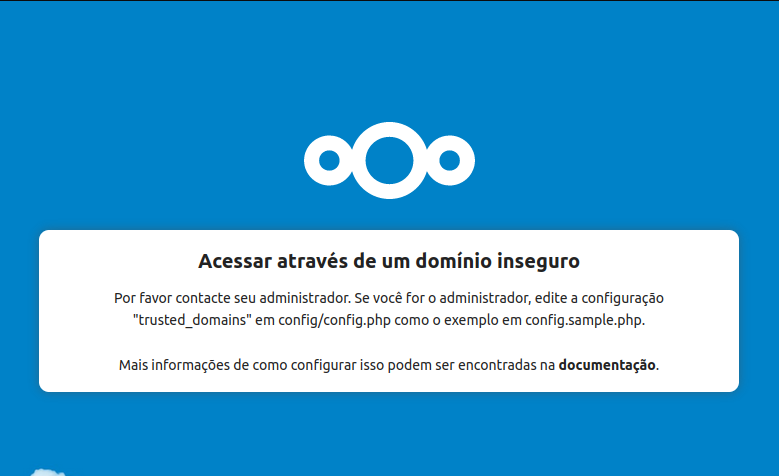

NextCloud
===================================

Instalação
------------------

Atualiza:

`sudo apt update`

`apt list --upgradable`

`sudo apt upgrade -y`

Instalando o suporte ao snap

`sudo apt install snapd -y`

Instalando o Nextcloud

`sudo snap install nextcloud`

Após isso basta acessar o servidor, com o IP pelo navegador. Você será direcionado á pagina de login, solicitando que crie seu usuario.

Troubleshooting
--------------------

### Erro no primeiro acesso

Logo no primeiro acesso, depois da instalação,

Acessar através de um domínio inseguro

Por favor contacte seu administrador. Se você for o administrador, edite a configuração "trusted_domains" em config/config.php como o exemplo em config.sample.php.

Mais informações de como configurar isso podem ser encontradas na documentação.



Como diz no aviso, você deve editar o arquivo *config/config.php* que estará na pasta de instalação do Nextcloud tendo sua localização dependendo da forma que foi instalado.

`vim config/config.php`

Neste arquivo, inclua o ip

```
'trusted_domains' =>
   [
    'demo.example.org',
    '10.111.112.113',
    '[2001:db8::1]'
  ],
```

ou

```
'trusted_domains' =>
  array (
    0 => '192.168.0.123', // IP do host que foi instalado o Nextcloud
    1 => 'seudominio.com.br', // Domínio da rede ou DDNS.
  ),
```

Depois, reinicie o servidor:

`sudo reboot`

Fonte
------------------------------

* <https://docs.nextcloud.com/server/23/admin_manual/installation/example_ubuntu.html>

* <https://help.nextcloud.com/t/this-problem-is-usually-solved-by-giving-the-web-server-write-access-to-the-config-directory/26322>
